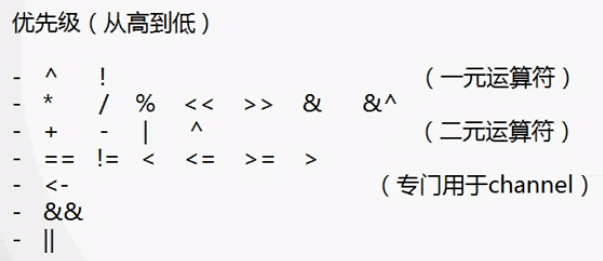

# Golang 编程基础

#### 注意事项

- 只有package名称为main的包可以包含main函数

- 一个可执行程序只可以有一个main

- 可见性规则

	- 函数名首字母大写为public
	- 函数名首字母小写为private

#### 一般的代码架构

	```go
	// 当前程序的包名，需放在所有代码之前
	package main
	
	// 导入其它的包
	import std "fmt"  //std是重命名，类似于Python中的import fmt  as std
	
	/*
	import . "fmt" //省略调用，可以在程序中省略包名直接使用
	*/
	
	/*
	import {
	    "fmt",
	    "os",
	    "time"
	}
	*/
	
	// 常量的定义
	const PI = 3.14
	
	// 全局变量的声明与赋值
	var name = "gopher"
	
	// 一般类型声明
	type newType int
	
	// 结构的声明
	type gopher struct{}
	
	// 接口的声明
	type golang interface{}
	
	// 由 main 函数作为程序入口点启动
	func main() {
		std.Println("Hello world!你好，世界！")
	}
	```


​	

#### 数据类型

| 数据类型                    | 关键字                        | 备注                                                         |
| --------------------------- | ----------------------------- | ------------------------------------------------------------ |
| 布尔                        | bool                          | 长度：1字节<br />取值范围：true，false<br />不可用数字代替true和false |
| 整型                        | int/uint[^1]                  | 根据运行平台为32/64位                                        |
| 8位整型                     | int8/uint8                    | 长度：1字节<br />取值范围：-128~127/0~255                    |
| 16位整型                    | int16/uint16                  | 长度：2字节                                                  |
| 32位整型                    | int32(*rune*)/uint32          | 长度：4字节                                                  |
| 64位整型                    | int64/uint64                  | 长度：8字节                                                  |
| 浮点型                      | float32/float64               | 长度：4/8字节<br />小数位：精确到7/15位小数                  |
| 字节类型                    | byte(*uint8*)                 |                                                              |
| 复数                        | complex64/complex128          | 长度：8/16字节                                               |
| 足够保存指针的32/64位整数型 | uintptr                       |                                                              |
| 其他值类型                  | array<br />struct<br />string |                                                              |
| 引用类型                    | slice<br />map<br />chan      | slice  切片<br />chan  通道                                  |
| 接口类型                    | interface                     |                                                              |
| 函数类型                    | func                          |                                                              |

[^1]: 没有u的为有符号数，有u的为无符号数

- 类型零值：默认值
	- 通常为0
	- bool为false
	- string为空字符串

- math   数学工具包

#### 变量的声明与赋值

- 声明格式：      var <变量名>  <变量类型>

- 变量赋值：      <变量名> = <表达式>

- 声明并赋值：  var <变量名> [变量类型] = <表达式>

- 简化的赋值：  <变量名> := <表达式>

- 不存在隐式转换，必须显示声明

#### 常量与变量名

##### 常量

- 关键字 ：const
- 若右侧为函数则必须为内置函数
- 必须为一个不被修改的值
- 一般为全大写
- 枚举
    - iota是常量及数据，从0开始，在每个const中从零开始递增1
    - 每定义一个常量iota就增加1

##### 运算符

- 

- `^`作为二元运算符是只相同位上，两个一个为`1`一个为`0`时结果为`1`
- `&^`当第二个数的某一位为`1`时，将其对应位改成`0`
- 在golang中，`&`和`|`仅进行位运算法，`&&`与`||`才可以进行逻辑判断


```go
const (
   B = 1 << (iota * 10)
   KB
   MB
   GB
   TB
   PB
   EB
   ZB
   YB
)
```

- 指针
	- 不可以进行指针的运算
	- `&`为取址，`*`为访问指针对象
	- 默认值是`nul`
- `++`与`--`不是表达式而为语句，不可以作为表达式赋值给某一变量

#### 控制语句

##### 条件语句

- 条件表达式没有括号

- 支持初始化表达式

  - ```go
    package main
    
    import "fmt"
    
    func main()  {
       if a := 1;a>0{
          fmt.Print("ok")
       }
    }
    ```

  - `if`或`else`连接的左大括号必须与`if`或`else`在同一行

    ##### 循环语句

    - 只存在`for`为关键字的循环语句

    - 存在三种形式
      - ```go
      	package main
      	
      	import "fmt"
      	
      	func main()  {
      	   a := 1
      	   for {
      	      a ++
      	      if a>5{
      	         break
      	      }
      	   }
      	   fmt.Print(a)
      	}
      	```

      -    ```go
      	package main
      	
      	import "fmt"
      	
      	func main()  {
      	   a := 1
      	   for a < 5 {
      	      a ++
      	   }
      	   fmt.Print(a)
      	}
      	```

      - ```go
      	package main
      	
      	import "fmt"
      	
      	func main()  {
      	   a := 1
      	   for i := 0;i<10;i++ {
      	      a ++
      	   }
      	   fmt.Print(a)
      	}
      	```

    - 左大括号需要与for在同一行

    - 不建议在条件语句中使用函数，如果是函数则会在每次循环时都执行一遍函数，拖慢速度

##### 选择语句(switch)

- 不需要写break，一旦找到符合的，直接跳出整个switch语句块。如果不希望跳出，使用`fallthrough`语句

-  若条件为表达式，需要加分号

- 代码示例

  - ```go
  	func main()  {
  		a := 1
  		switch a {
  		case 0:
  			fmt.Print("0")
  		case 1:
  			fmt.Print("1")
  		case 2:
  			fmt.Print("2")
  		default:
  			fmt.Print("can't find")
  		}
  	}
  	```

  - ```go
  	func main()  {
  		a := 1
  		switch  {
  		case a == 0:
  			fmt.Print("0")
  		case a == 1:
  			fmt.Print("1")
  		case a == 2:
  			fmt.Print("2")
  		default:
  			fmt.Print("can't find")
  		}
  	}
  	```

  - ```go
    func main()  {
    	switch 	a := 1;{
    	case a == 0:
    		fmt.Print("0")
    	case a == 1:
    		fmt.Print("1")
    	case a == 2:
    		fmt.Print("2")
    	default:
    		fmt.Print("can't find")
    	}
    }
    ```


##### 跳转语句

- `break`、`continue`、`goto`可以配合使用

- 标签名区分大小写

- ```go
  func main()  {
      LABLE1:
      for {
          for i:= 0; i < 10; i++{
              if i > 3 {
                  break LABLE1
              }
          }
      }
  }
  ```


- 对于`break`、`continue`会跳转到这个循环结束

- 对于`goto`会跳转到代码行所在位置

#### 数组

- 定义：var <变量名> [数组长度，也可以为空或`…]<每一个元素的类型> {初始化的值，用逗号隔开，或使用   `索引:值`}

- 长度为类型的一部分

- 数据是值类型

- 可以使用 `==` 以及 `!=` 但不可以进行大于或等于

  - 类型要相同才可以比较(长度数据类型的一部分)

- 数据的截取与Python语法相同

- `new`可以建立新的指向数组的指针

    - ```go
      func main()  {
        a := [10]int{}
        a[1] = 2
        fmt.Print(a)
        p := new([10]int)
        p[1] = 2
        fmt.Print(p)
      }
      ```

- 多维数据

  - ```go
  	func main()  {
  		a := [][]int{
  			{1:1},
  			{2:1},
  		}
  		fmt.Print(a)
  	}
  	```

- 冒泡排序

  - ```go
    func main()  {
    	a := []int{5,4,8,7,1,2,6,4,2,5,8,9,7,1,3}
    	a_len := len(a)
    	for i := 0;i < a_len-1; i++{
    		for j := 0; j < a_len-1; j++{
    			if a[j] > a[j+1]{
    				temp := a[j]
    				a[j] = a[j+1]
    				a[j+1] = temp
    			}
    		}
    	}
    	fmt.Print(a)
    }
    
    ```

#### 切片slice

- 本身不是数组但是指向底层的数组
- 作为边长数组的替代方案，可以关联底层数据的局部或全部
- 应用类型
- 可以直接创建或从底层数据获取生成
- `len()`获取元素个数，`cap()`获取容量
- 可使用mark创建
- 多个slice指向同一个数组时，其中一个值改变会影响全部

- 声明
  - make([]T,len,cap)
  - 其中cap可以省略，默认值与len相同

- 通过截取数组获得

  - ```go
  	func main()  {
  		a := [11]int{}
  		fmt.Println(a)
  		b := a[:]
  		fmt.Println(b)
  	}
  	```

- Reslice

  - 以基准的slice切片为基准
  - 不可以超过slice切片的容量
  - 索引越界不会导致底层数组重新分配而是引发错误

- 相关操作

  - append

    - 可以在slice尾部追加元素

    - 可以将一个slice追加到另一个slice的尾部

    - 如果长度未超过追加后的容量则发挥原始的slice

    - 否则重新分类内存地址并返回新的slice

    - 用法：

    	- ```
    		s1 = append(s1, 1, 2, 3, 4, 5) 
    		```

  - copy

    - ```go
      copy(s1, s2)//将s2拷贝到s1
      ```

    - 长度以`s1`为基准，内容以`s2`为基准

  - 迭代循环 

  	- ```go
  		func main()  {
  			a := [11]int{}
  			fmt.Println(a)
  			b := a[:]
  		    for i,v := range b{  // i为索引，v为该索引位置的值(拷贝)，直接对v修改不会改变slice的值
  				fmt.Println(i,v)
  			}
  		}
  		```

  	- 

#### map

- 类似于哈希表或者字典，以key-value形式存储数据

- key不可以是函数、map或slice

- map查找比线性搜索快，但比索引访问数据慢100倍

- 使用`make()`创建，支持`:= `的简写形式

- 声明
  - make([key的类型]value的类型, 容量)，cap代表容量，可以省略
  - 超出容量时会自动扩容
  - `len()`代表长度，`cap()`代表容量

- 键值对不存在时自动添加，使用`delete(map，key)`删除某一键值对

- 使用for range对map和slice进行迭代操作

- 读写操作与Python相同

- map中嵌套map的例子

  - ```go
    func main()  {
    	m := make(map[int]map[int]string)
    	m[1] = make(map[int]string)
    	m[1][1] = "10"
    	fmt.Print(m)
    }
    ```

  - 需要对每一级的map进行单独的初始化

  - 需要判断每一级的map是否已经被初始化了

- 利用状态判断键值对是否被初始化了

  - ```go
    func main()  {
    	m := make(map[int]map[int]string)
    	m[1] = make(map[int]string)
    	a, status := m[1]  //第二个返回值代表了键值对是否存在
    	fmt.Println(a,status)
    }
    ```


- 迭代取值

	- ```go
		func main()  {
			a := make(map[int]int)
			a[1] = 1
			a[2]=2
			for k,v := range a{  // k,v为map中对应的键值对
				fmt.Println(k,v)
			}
		}
		```

	- 验证在slice中获得的值为拷贝的例子

		- ```go
			func main()  {
				s := make([]map[int]int, 10)
				for _, v := range s{
					v = make(map[int]int)
					v[1] = 1
				}
				fmt.Println(s)
			
				for i, _ := range s{
					s[i] = make(map[int]int)
					s[i][1] = 1
				}
				fmt.Println(s)
			}
			```

#### 函数function
- 不支持嵌套、重载和默认参数

- 支持特性

  - 无需声明原型
  - 不定长度变参
  - 多返回值
  - 命名返回值参数
  - 匿名函数(不可以作为外层函数)
  - 闭包

- `func`，左大括号要在同一行

- 函数可以作为类型使用

- 一些实例

  - ```go
  	func test(a,b,c int)  (d,e,f int){}
  	```

  - ```go
  	func test() (int, int, int){}
  	```

  - ```go
  	func test(a ...int)  {
  	    /*
  	    不定长参数的传递：
  	        - 不定参参数只能卸载参数列表是最后一个
  	        - 传入的a为slice类型
  	        - 传入是只是拷贝，修改值并不会以影响原始的变量的值
  	    */
  		fmt.Println(a)
  	}
  	```

  - ```go
  	func test(s []int)  {
  		/*
  		传入的参数为slice形式的时候
  			- 对其值改变会导致原始值的改变
  			- 传入的仍是拷贝，但由于slice是引用类型，所以拷贝进来的还是内存地址
  		*/
  	}
  	```

  - ```go
  	/*
  	利用指针在函数中对原始值进行操作
  	*/
  	func main()  {
  		s1 := 1
  		test(&s1)
  		fmt.Println(s1)
  	}
  	
  	func test(s *int)  {
  		*s++
  		fmt.Println(*s)
  	}
  	```

  - ```go
  	func main()  {
  		a := func() {fmt.Println("匿名函数")}
  		a()
  	}
  	```

  - ```
  	
  	//闭包
  	func main()  {
  		f := closure(10)  // 此时f为一个函数，传入值为y，返回值为10+y
  		fmt.Println(f(1))
  	}
  	
  	func closure(x int)  func(int) int{
  		return func(y int) int {
  			return x + y
  		}
  	}
  	```

- defer

  - 执行方式类似于析构函数，在函数体执行结束后按照调用的相反顺序逐个执行

  - 即使函数发生**严重错误**也会执行

  - 支持匿名函数的调用

  - 常用语资源清理，文件关闭、解锁以及记录时间等操作

  - 通过与匿名函数的配合在return后修改函数计算结果

  - 如果函数体内某个变量作为defer时匿名函数的参数，则在定义defer时已经获得了拷贝，否则则是引用某个变量地址

  - 代码样例

  	- ```go
  		func main()  {
  			/*
  			- 输出结果为132
  			- defer在程序执行结束后执行
  			- defer逆序往上调用
  			 */
  			fmt.Printf("1")
  			defer fmt.Printf("2")
  			defer fmt.Printf("3")
  		}
  		```

  	- 

- 没有异常机制，可以通过panic/recover来处理错误

- panic可以在任何地方引发，但recover只有在defer调用的函数中有效

- ```go
  func main()  {
  	a()
  	b()
  	c()
  }
  
  func a(){
  	fmt.Println("a")
  }
  
  func b()  {
  	defer func() {  //defer需要放在panic之前
  		if err := recover(); err != nil{
  			fmt.Println("Recover b")
  		}
  	}()
  
  	panic("b")  //此处会引发异常
  }
  
  func c()  {
  	fmt.Println("c")
  }
  ```

#### 结构 struct 

- go没有class

- 使用type<name> struct{}定义结构

- 支持指向自身的指针类型成员

- 支持匿名结构，可做成员或定于成员变量

- 匿名结构也可以作为map的值

- 可以使用字面值对结构初始化

- 允许通过指针来读写结构成员

- 相同类型的成员可以进行直接拷贝赋值

- 支持 `==`与`!=`比较运算符当不支持大于或小于

- 支持匿名字段，本质上是定义了以某个类型名为名称的字段

- 可以使用匿名字段指针

- 建议在初始化的时候使用`&`直接获取地址

- 是值类型

- 一些代码示例

  - ```go
    type persion struct {
    	name string
    	age  int
    }
    
    func main()  {
    	a := persion{
    		name:"name",
    		age: 18,
    	}
    	b := persion{
    		"name",
    		18,
    	}
    	fmt.Println(a)
    	fmt.Println(a==b)
    }
    ```

  - ```go
    type human struct {
    	Sex int
    }
    
    type teacher struct {
    	human
    	Name string
    	Age  int
    }
    
    type student struct {
    	human
    	Name string
    	Age  int
    }
    
    func main()  {
    	b := human{Sex:1}
    	a := student{Name:"name", human: human{Sex:1}}  //匿名结构默认结构名为变量名
    	a.Sex = 19 // 嵌入结构可以直接当做本身的属性来修改值   
    	fmt.Println(a, b)
    }
    ```

- 嵌入结构的重名可以按照一个变量来操作
#### 方法method

- 通过显示说明receiver来实现与某个类型的组合

- 只能为同一个包中的类型定义方法

- receiver可以是类型的值或指针

- 不存在方法重载

- 可以使用值或指针来调用方法

- 从某种意义上来说，方法是函数的语法糖，因为receiver其实就是方法所接收的第一个参数

- 如果外部结构和嵌入结构存在同方法名，这邮箱调用外部的结构方法

- 类型别名不会拥有底层类型所附带的方法

- 方法可以调用结构中的非公开字段

- 代码示例

  - ```go
    type A struct {
    	Name int
    }
    
    func main()  {
    	a := A{}
    	a.Print()
    	fmt.Println(a.Name)
    }
    
    func (a *A) Print()  {  // 将a与结构A绑定   如果是指针类型的会直接修改a的值
    	a.Name = 10
    	fmt.Println(*a)
    }
    ```


#### 接口interface
- 接口是一个或多个方案签名的结合

- 只要某个类型拥有改接口的所有方法签名，即算实现该接口，无需显示声明实现了哪个接口，这被称为Structural Typing

- 接口只有方法声明，没有实现，没有数据字段

- 接口可以匿名嵌入其他接口或嵌入结构中

- 将对象赋值给接口时，会发生拷贝，而接口内部存储的是指向这个复制品的指针，既无法修改复制品的状态，也无法获取指针

- 只有当接口存储的类型和对象都为nil值，接口才等于nil

- 接口调用不会做receiver的自动转换

- 接口同样支持匿名字段的方法

- 接口也可实现类似OPP中的多态

- 空接口可以作为任何类型数据的容器

- 一些实例

	- ```go
		//接口的实现
		type USB interface {
			Name() string
			Connect()
		}
		
		type PC struct {
			name string
		}
		
		func (pc PC)Name()  string{
			return pc.name
		}
		
		func (pc PC)Connect()  {
			fmt.Println(pc.name)
		}
		
		func main()  {
			var a USB
			a = PC{"pcpcpcpc"}
			a.Connect()
			fmt.Println(a.Name())
		}
		```

	- ```go
		type USB interface {
			Name() string
			Connect()
		}
		
		type PC struct {
			name string
		}
		
		func (pc PC)Name()  string{
			return pc.name
		}
		
		func (pc PC)Connect()  {
			fmt.Println(pc.name)
		}
		
		func main()  {
			var a USB
			a = PC{"pcpcpcpc"}
			a.Connect()
			fmt.Println(a.Name())
			disconnect(a)
		}
		
		func disconnect(usb interface{})  {
			if pc, ok := usb.(PC);ok{
				fmt.Println(pc.name)
			}
		}
		```
- ==type switch==
#### 反射reflection
- 反射可以提高灵活性，使得`interface()`有更大的发挥余地

- 反射使用TypeOf和ValueOf函数从接口中获取目标信息

- 反射会将匿名字段作为独立字段

- 想要利用反射修改对象状态的前提是`interface.data`是settable，即pointer-interface

- 通过反射可以“动态”调用方法

- 一些实例

	- ```go
		func main()  {
			x := 123
			v := reflect.ValueOf(&x)
			v.Elem().SetInt(999)  //通过elem来获取的value值
			fmt.Print(x)
		}
		```

	- ```go
		type User struct {
			Id,Age int
			Name string
		}
		
		func main()  {
			u := User{1,2, "HHHHH"}
			Set(&u)
			fmt.Print(u)
		}
		
		func Set(o interface{})  {
			v := reflect.ValueOf(o)
		
			if v.Kind()  == reflect.Ptr && !v.Elem().CanSet(){
				fmt.Println("不可以被修改")
				return
			}else {
				v = v.Elem()
			}
		
			f := v.FieldByName("Name")
			if !f.IsValid(){
				fmt.Println("未找到")
				return
			}
		
			if f.Kind() == reflect.String{
				f.SetString("BYBYBY")
			}
		
			//if f := v.FieldByName("Name"); f.Kind() == reflect.String{
			//	f.SetString("BYBYBY")
			//}
		} 
		```

	- ```go
		type User struct {
			Id,Age int
			Name string
		}
		
		func (u User)Hello(name string)  {
			fmt.Println(name, u.Name)
		}
		
		func main()  {
			u := User{1,2, "OK"}
			u.Hello("Joe")
		
			v := reflect.ValueOf(u)
			mv := v.MethodByName("Hello")
		
			args := []reflect.Value{reflect.ValueOf("Joe")}
			mv.Call(args)
		
		}
		```

####  并发concurrency
- 最简单的实例

	- ```go
		func main()  {
			go Go()
			time.Sleep(time.Second) // 使用常量避免单位导致的错误
		}
		
		func Go()  {
			fmt.Println("gogogo")
		}
		```

	- goroutine奉行通过通信来共享内存而不是共享内存来通信

	- channel

		- 是goroutine沟通的桥梁，大都是阻塞同步的

		- 通过make创建，close关闭

		- 可以使用for range来迭代不断的操作channel

		- 可以设置单向或双向通道

		- 可以设置缓存大小，在未被填满前不会发生阻塞

			- 有缓存是异步的，无缓存是同步的

		- 一些实例

			- ```go
				func main()  {// channel的基础操作
					c := make(chan bool)
					go func(){
						fmt.Println("gogogo")
						c <- true
					}()
					<-c
				}
				```

			- ```go
				func main()  {
					c := make(chan bool)
					go func(){
						fmt.Println("gogogo")
						c <- true
						close(c)// 如果不close会出现死锁
					}()
					for v := range c{
						fmt.Println(v)
					}
				}
				```

			- ```go
				func main()  {
					runtime.GOMAXPROCS(runtime.NumCPU()) //获得当前CPU的核数并设置
					c := make(chan bool, 10)
					for i:= 0;i<10;i++{
						go Go(c, i)
					}
					for i := 0;i<10;i++ {//当每一个都执行完的时候，这个for循环就执行完了
						<-c
					}
				}
				
				func Go(c chan bool,index int)  {
					a := 0
					for i := 0 ;i < 10000000; i++{
						a += i
					}
					fmt.Println(index,a)
					c <- true
				}
				```

			- ```go
				func main()  {
					/*
					- 每新建一个任务就增加一个任务数
					- 每完成一个任务就减少一个任务数
					- main函数中等待任务数为0
					 */
					runtime.GOMAXPROCS(runtime.NumCPU()) //获得当前CPU的核数并设置
					wg := sync.WaitGroup{}
					for i:= 0;i<10;i++{
						go Go(&wg, i)
						wg.Add(1)
					}
					wg.Wait()
				}
				
				func Go(wg *sync.WaitGroup,index int)  {
					a := 0
					for i := 0 ;i < 10000000; i++{
						a += i
					}
					fmt.Println(index,a)
					wg.Done()
				}
				```

			- 

	- select

		- 可处理一个或多个channel的发送与接收

		- 同时有多个可用的channel时按随机顺序处理

		- 可用空的select来阻塞main

		- 可以设置超时

		- 实例

			- ```go
				func main()  {
					c1,c2 := make(chan int), make(chan string)
					o := make(chan bool,2)
					go func() {
						//a,b := false,false
						for {
							select {
							case v,ok := <-c1:
								if !ok{
									//if !a{
										o <- true
										//a = !a
									//}
									break
								}
								fmt.Println(1,v)
							case v,ok := <-c2:
								if !ok{
									//if !b{
										o <- true
										//b = !b
									//}
									break
								}
								fmt.Println(2,v)
							}
						}
					}()
				
					c1 <- 1
					c2 <- "hello"
					c1 <- 2
					c2 <- "hi"
					close(c1)
					close(c2)
					for i:=0 ;i<2 ;i++{
						<-o
					}
				}
				```

			- ```go
				func main()  {
					c := make(chan bool)
					select {
					case v:= <-c:
						fmt.Println(v)
					case <-time.After(3 * time.Second):
						fmt.Println("超时")
					}
				}
				```

			- 

	


